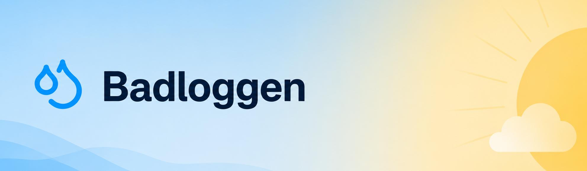
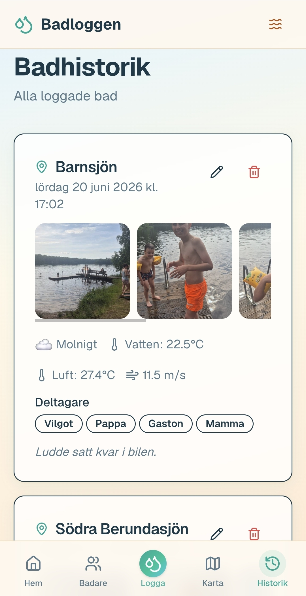
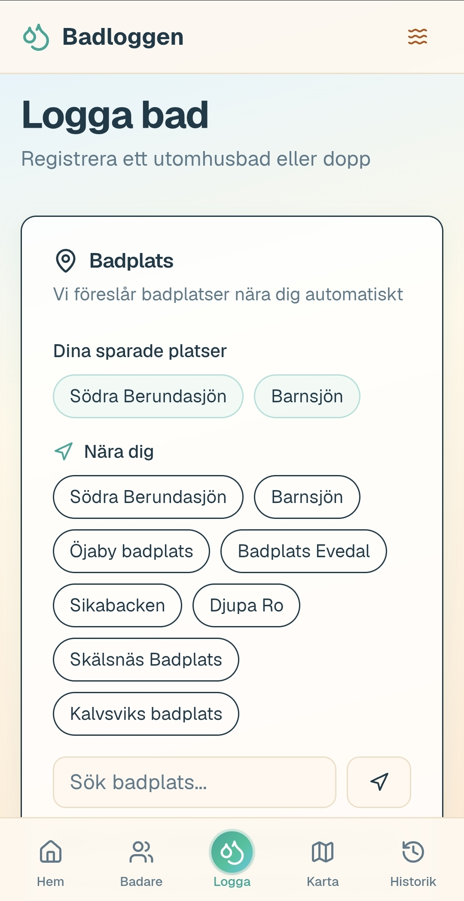
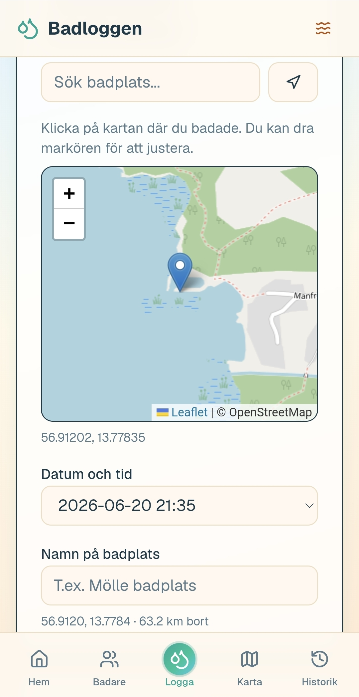
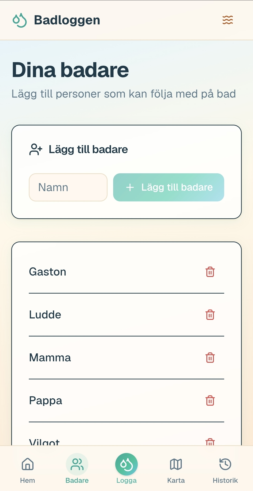
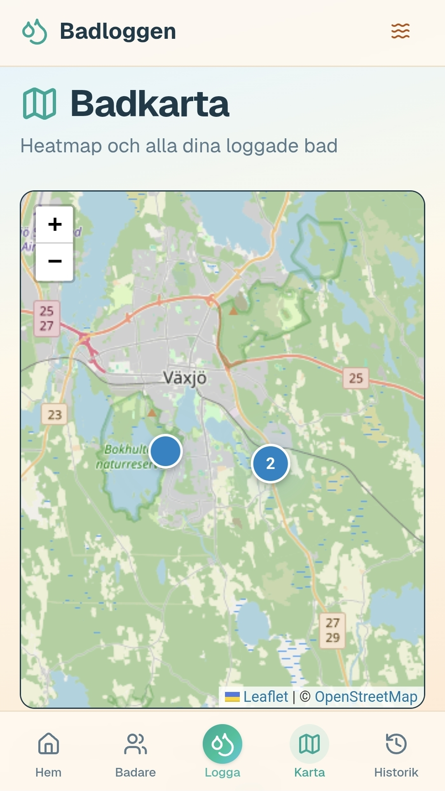

<p align="center">
  
</p>

# Badloggen

[](LICENSE)

Logga utomhusbad tillsammans — platser, deltagare, väder och foton. Öppen källkod, svenska, fungerar i webbläsaren utan konto.

**Live:** [badloggen.vercel.app](https://badloggen.vercel.app/)

<p align="center">
  
</p>

## Appen

Badloggen är till för gäng som badar utomhus. Ni lägger till badare, loggar varje dopp och följer vem som badat mest.

## Vad vi vill göra

Vi vill bygga **Sveriges bästa app för utomhusbad** — enkel, rolig och byggd tillsammans. Tävla med familj och vänner om flest dopp, längsta streak eller kallaste vattnet. Logga vardagsdopp och vinterbad på samma ställe.

**Det här finns redan:**

- **Logga varje dopp** – plats, deltagare, väder, vattentemperatur och foton
- **Topplista i gänget** – se vem som badat mest
- **Historik** – bläddra, redigera och minnas tillbaka
- **Badkarta** – alla era platser på en karta

**Det här vill vi bygga vidare — med dig:**

- **Delade gäng** – bjud in familj och vänner så att flera kan logga till samma gäng (mamma loggar från mobilen, pappa från sin, barnen från sina)
- **Konto och synk** – samma data på telefon, surfplatta och dator
- **Topplistor och utmaningar** – lokala ligor, säsongstävlingar, streaks och badges (*"30 dopp i juli"*, *"isbadaren"*)
- **Sverige-topplistan** – jämför med andra utomhusbadare runt om i landet (på ett sätt som känns lagom och roligt, inte stressigt)
- **Utmaningar mellan vänner** – skicka en utmaning, följ varandras framsteg, fira när någon tar ledningen
- **Upptäck badplatser** – populära platser nära dig, favoritmarkeringar, kanske recensioner från communityt
- **Säsongsöversikt** – årets sammanfattning, kallaste dopp, varmaste dag, flest bad tillsammans
- **Dela dopp** – vackra kort att dela efter badet (*"22,5° i Barnsjön — Vilgot, Pappa och Gaston"*)
- **Notiser och påminnelser** – *"Vattnet är 19° vid er favoritplats idag"*
- **Offline och PWA** – logga även när täckningen är dålig vid sjön
- **Fler datakällor** – isläge, vattenkvalitet, badflaggor — förslag välkomna

Ingen av idéerna ovan är helig. Saknar du något? [Öppna en issue](https://github.com/13pixlar/badloggen/issues) eller ta tag i det själv — det mesta börjar med ett litet PR.

| | |
|:---:|:---:|
| **Logga bad** — välj badplats | **Karta och pin** — OpenStreetMap |
|  |  |
| **Badare** — lägg till gänget | **Badkarta** — heatmap över alla dopp |
|  |  |

**Funktioner:** topplista · historik · heatmap · platsförslag (Sverige) · väder (Open-Meteo) · vattentemperatur (Open-Meteo Marine / SMHI)

## Bygg tillsammans

Badloggen är öppen källkod — vi bygger den tillsammans. Oavsett om du kodar, designar, skriver texter, testar eller bara har idéer: hoppa in.

1. Forka repot och skapa en branch från `main`
2. Gör ändringar och testa lokalt (`npm install` → `npm run dev`)
3. Öppna en [pull request](https://github.com/13pixlar/badloggen/pulls) mot `main`

- **Idéer och buggar** → [issues](https://github.com/13pixlar/badloggen/issues)
- **Detaljer** → [CONTRIBUTING.md](CONTRIBUTING.md)

`main` är branch-skyddad. Ändringar mergas av maintainers via PR och deployas automatiskt till produktion.

## Utveckling

Next.js 16 · React 19 · TypeScript · shadcn/ui · Tailwind · Leaflet · sql.js

**Data idag:** All appdata lagras i webbläsaren — SQLite via sql.js, persistens i IndexedDB. Inget konto, ingen serverdatabas i bruk; data är per enhet och webbläsare. Väder och badplatser hämtas vid loggning från Open-Meteo, SMHI och OpenStreetMap. Det här är medvetet enkelt att börja med, men inget som är låst — delade gäng, konto och synk är exakt den sortens förändring vi gärna bygger tillsammans.

```bash
git clone https://github.com/13pixlar/badloggen.git
cd badloggen
npm install
npm run dev
```

Öppna [http://localhost:3000](http://localhost:3000).

## Deploy

Produktion körs på Vercel från `main`. GitHub Pages-export sker via `.github/workflows/deploy.yml` efter merge till `main`.

## Licens

[MIT](LICENSE)
